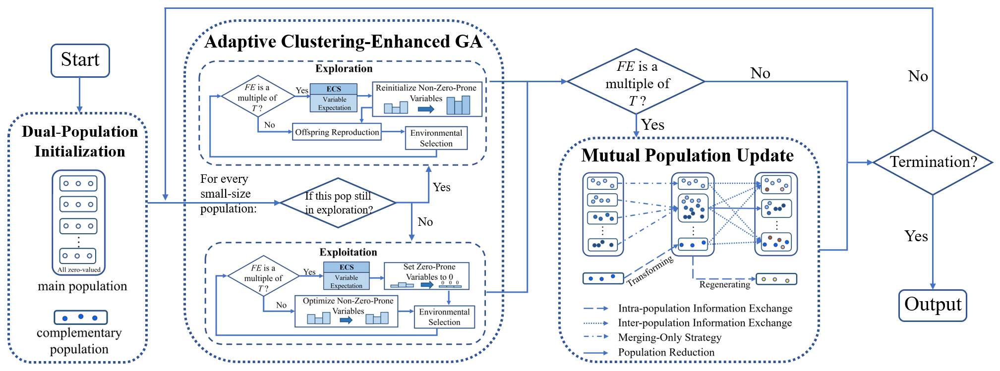

# MMEA-IDC

This MATLAB code is written by the [PlatEMO](https://github.com/BIMK/PlatEMO) framework 4.2.

MMEA-IDC proposes a new perpective in solving ***sparse multi-modal multi-objective*** optimization problems by introducing a large main population for convergence and a small complementary population for diversity, which makes it achieve good performance effectively.

This code is from the paper 'A Size-Imbalanced Dual Population with Complementary Search for Sparse Large-Scale Multi-Modal Multi-Objective Optimization', just accepted in 'IEEE Transactions on Evolutionary Computation'

## General framework

## Matlab Version

Required by PlatEMO 4.2

## Installation

Users can add this code into the 'PlatEMO/Algorithms/Multi-objective optimization'. 

## Contact

Xiangyu Wang: [xiangyu.wang@uni-bielefeld.de](xiangyu.wang@uni-bielefeld.de) or [xiangyu_wang1216@163.com](xiangyu_wang1216@163.com)
-[Google Scholars](https://scholar.google.com.hk/citations?user=bWW6MRsAAAAJ&hl=zh-CN)
